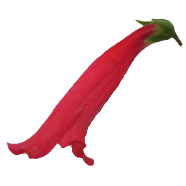
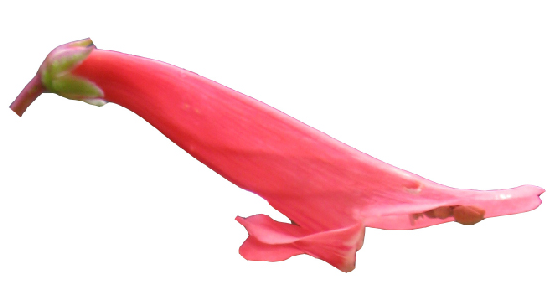

<br>

```{css, echo=FALSE}
caption {
  display: table-caption;
  text-align: left;
  font-size: 14px;
  padding: 10px;
}

@media screen and (max-width: 480px) {
  table{
    width: 100%;
    position: center;
  }
}
```

#Additional Research Directions

***

### **What microevolutionary processes contribute to differential diversification rates?**

Does pollination by bees vs. hummingbirds structure genetic variation in different ways within and between populations across the landscape? 

If so, could this affect species diversification rates, providing a link between microevolutionary processes and a macroevolutionary pattern?


***

### **Interactions between speciation and complex adaptation**

Closely-related *Penstemon* species with alternative pollination syndromes often have at least partially overlapping distributions. How are species boundaries (and divergent floral adaptations) are maintained in the face of gene flow?

***

### **How do complex traits vary within populations?**

Recent work in a bee-pollinated population found that flower shape traits are positively correlated, parallel to the direction of selection during adaptation to hummingbird pollination. *This is proof-of-concept that this approach can detect small effect loci associated with trait variation in natural populations.*

What is the heritability of complex floral variation within populations and what is their effects on mating system?

***

### **What is the degree of morphological convergence in parallel adaptation?**

<table class="image" align="left">
<caption align="bottom">*P. eatonii* exhibits hummingbird floral syndrome.</caption>
<tr><td></td></tr>
</table>

<table class="image" align="right">
<caption align="bottom"> *P. barbatus* also exhibits hummingbird floral syndrome.</caption>
<tr><td></td></tr>
</table>

How convergent are hummingbird syndrome species in multivariate trait space? Do we see a single cloud of points or multiple peaks? Is shape related to the shape of ancestral bee syndrome species (suggesting adaptation along lines of least resistence?) Or can same hummingbird syndrome form be accessed from anywhere in bee syndrome morphospace? Does shape similarity correlate with history of introgression?
