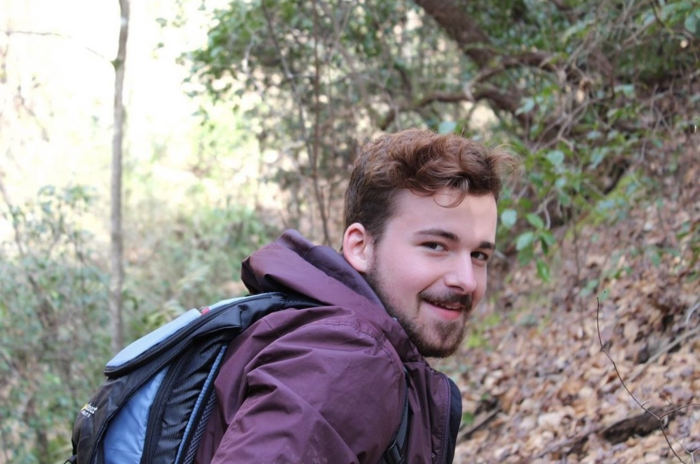

<!--hello, this is an html comment--> 
<!--the title here NORMALLY controls the big text at the top of this web page as well as the title shown within the tab but I changed that so this title only controls the text within the tab for all .Rmds/.htmls (the change is coded within the in_header.html) because I wanted the information in the tab to say something different than the text at the top of each web page--> 
<br>
<!-- anything within carrots is html code that will by knitted into the .html output my knitting the .rmd-->
<!-- br means break and inserts an empty line, i think the size of the break is based on the default size of the body text-->

# Alumni
<!-- header 1, aka the large font that is centered at the top of the web page, best to leave a line between headers and other code, otherwise sometimes rmd won't format them correctly -->


<!--the code below indicates this is a code block containing code (within the ```) in the language css and we don't want this code to be echoed onto the website (echo=F)-->
<!--note: no comments can be made within the code block bc rmd is weird so all comments will be below the block and will occur below a comment out version of the thing excatly as it appears within the block,--> 
<!-- ```{css, echo=FALSE}
<!-- img { -->
<!--     width:  400px; -->
<!--     height: 400px; -->
<!--     padding: 10px; -->
<!--     object-fit: cover; -->
<!-- } -->
<!-- in this css code block the images called within the rest of this web page (with the html tag "img") are formatted to all be the same size (height:400px; and width:400px; means a square with a height and width of 400 pixels each) with 10 pixels of padding around it (padding: 10px; keeps from the text being too close to it)
object-fit: cover; defines how the actual image fits within the image container that is made by the height, width and padding commands above), this ensures that if the raw image is bigger or smaller than the set height and width, it will be resized to take up all available space while maintaining the right aspect ratio, if you don't like how one of the images looks here DO NOT CHANGE THIS instead crop the image differently -->
<!-- removing the above code from working bc I want to add in twitter images, this formatting will now be in each image itself instead of above-->


<br>
<!-- for each person, I currently have set the image (see above) then one break (this line) then their name as a h4 (see below)-->

#### Ben Stone 
<!-- 4 hastags mean this is a header of size h4, the fourth biggest (size set in style.css), this size is currently consistent for all people's names within this page-->

Ben was an NSF Postdoc Fellow in the lab from 2021-2025. His work focuses on hybridization and transitions to hummingbird pollination in the Dasanthera clade of Penstemon. Outside of the lab, Ben likes exploring nature and playing music. Ben joined the lab in the Fall of 2021. Ben started as an Assistant Professor in Fall 2025 at Mississippi State University!

[Stone Lab at MSU!](https://benstemon.github.io)

<!-- body text about the person (size set in style.css)-->

<br><br><br>


***

<!-- this is html that calls the container "img" (styled above in css) and fills it with the image linked within the src="path/to/img/from/rproj/dir"
align="left" aligns this image to the RIGHT of the screen, this is different than the image above and makes the alternating pattern currently seen on the website -->

<br>
<!-- for each person, I currently have set the image (see above) then one break (this line) then their name as a h4 (see below)-->

#### Josh Stevens 
<!-- 4 hastags mean this is a header of size h4, the fourth biggest (size set in style.css), this size is currently consistent for all people's names within this page-->

Josh was a PhD student in the lab from 2020-2025. His dissertation focused on describing mechanisms of flower color variation in a natural penstemon hybrid zone. In addition, he developed dissertation work focused on teaching pedagogy.


<!-- body text about the person (size set in style.css)-->
<br><br><br>

***


  
<br>

#### Ella Forrester 

Ella worked in the lab as an undergraduate student from the fall of 2023 to the fall of 2024. She is a Public Health major and is enrolled in the Honors College. Within the lab, she worked with Trinity on the function and genetic basis of personate Penstemon flowers. 

<br><br><br>

***


  
<br>

#### Albert Hatton 

Albert was an Honors College student that joined the lab in Fall 2022 and received his B.Sc in Fall of 2024. Albert's honors thesis focused on identifying the pigments underlying flower color variation in natural penstemon hybrid zones.  

<br><br><br>

***


  
<br>

#### Hoyt Williams 

Hoyt was an undergrad researcher from April 2021 to May 2022, when he graduated from U of SC with a BS in Biology. He then worked in the lab as a research technician until Summer 2024. His contributions to the lab cannot be overstated - he helped move every project in the lab forward.

<br><br><br>

***


  
<br>

#### Luke Wheeler

Luke was a postdoc in the lab from Fall 2022 - Summer 2024. He earned his PhD in Biochemistry at the University of Oregon, studying the evolution of binding specificity in the S100 proteins. His research in the Wessinger lab focused on studying adaptive introgression and floral trait evolution in the Habroanthus clade of Penstemon. He is currently an instructor in chemistry at Northglenn High School in Northglenn, Colorado.

<br><br><br>

***


  
<br>

#### Clayton Bellinger 
###### aka **Clay**

Clay worked in the lab as an undergrad from Spring 2021 - Fall 2022. He keeps over 350 species of plants, many of which are featured on his instagram. He has a special interest in species that are uncommon or ethnobotanically significant. In the Wessinger Lab, he assisted with plant care, fieldwork, and benchwork. He likes to hike and he likes his pet fishes.

<br><br><br>

***


<br>

#### Alice Norton

Alice worked in the lab as an undergrad from Spring 2022 - Fall 2022. She was a valued member of field expeditions and, in the lab, developed methods for quantifying variation in anthocyanin pigment production. In her free time she likes to run triathlons.

<br><br><br>

***


<br>

#### Nimue' Shive

Nim worked in the lab as an undergrad from Fall 2020 - Spring 2022. In the Wessinger Lab, she helped with plant care and to map *Penstemon* species ranges. She enjoys hiking, art, and chocolate cake.

<br><br><br>

***


<!-- this is html that calls the container "img" (styled above in css) and fills it with the image linked within the src="path/to/img/from/rproj/dir"
align="left" aligns this image to the LEFT of the screen 
height=400px and width=400px means a square with a height and width of 400 pixels each
style = everything that follows after this is css code 
"padding: 10px; gives 10 pixels of padding around it the image 
object-fit: cover;" defines how the actual image fits within the image container that is made by the height, width and padding commands above), this ensures that if the raw image is bigger or smaller than the set height and width, it will be resized to take up all available space while maintaining the right aspect ratio, if you don't like how one of the images looks here DO NOT CHANGE THIS instead crop the image differently-->

<br>
<br>
<!-- for each person, I currently have set the image (see above) then one break (this line) then their name as a h4 (see below)-->


#### Ashley Hamilton

Ashley worked in the lab from Aug 2020 - Aug 2021 as a lab technician. In the Wessinger Lab, her primary project involved analyzing the geographic distribution of *Penstemon* species to try to understand the underlying ecogeographic trends of pollination divergence.

<br> 

***


<center></center>
