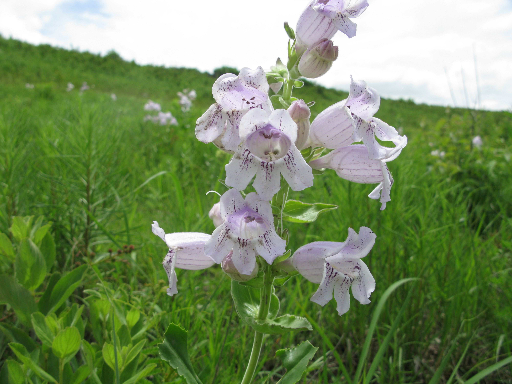

Hello!

<link rel="stylesheet" href="styles.css" type="text/css">

```{r, echo=FALSE, out.width="50%", fig.cap="*Penstemon cobaea* in the Konza prarie."}

```

Welcome to the Wessinger Lab website!  
My lab is currently located at the [University of South Carolina Department of Biological Sciences](https://www.sc.edu/study/colleges_schools/artsandsciences/biological_sciences/our_people/directory/wessinger_carolyn.php). The Wessinger Lab provides a collaborative and supportive environment for researchers studying microevolutionary processes that drive trait evolution and larger evolutionary patterns.  My lab's research investigates how genetic and ecological processes at the population level contribute to larger patterns and trends in complex trait evolution, specifically parallel evolution. Currently we are exploring these issues in Penstemon, an emerging model system for floral evolution.
