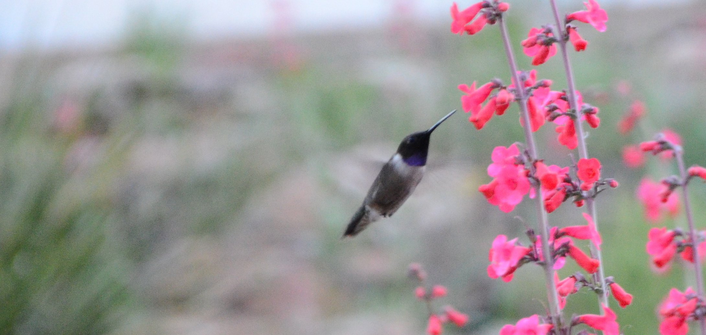

```{css, echo=FALSE}
h1 {
  text-align: center;
}
```

```{r, echo=FALSE, out.width="100%", fig.cap="A hummingbird visiting *Penstemon wrightii*. Photo by Josh Stevens", fig.align = 'center'}

```

<br><br><br>

#### Undergraduate Research Opportunities

Undergraduates interested in plant evolutionary biology are encouraged to inquire about research opportunities in the lab. The best time to begin undergraduate research is your sophomore year.
<br><br><br>

#### Information for Prospective Graduate Students

We are currently open to Phd or Masters students joining the lab... Resources include....
<br><br><br>

#### Information for Prospective Postdoctoral Fellows

We welcome inquiries from doctoral students interesting in pursuing postdoctoral research in the lab.
<br><br><br>

####About the University of South Carolina

UofSC is located in downtown Columbia, South Carolina. The campus has a rich history and a current focus on promoting new research.
<br><br><br>

You can contact me at:
WESSINC@mailbox.sc.edu