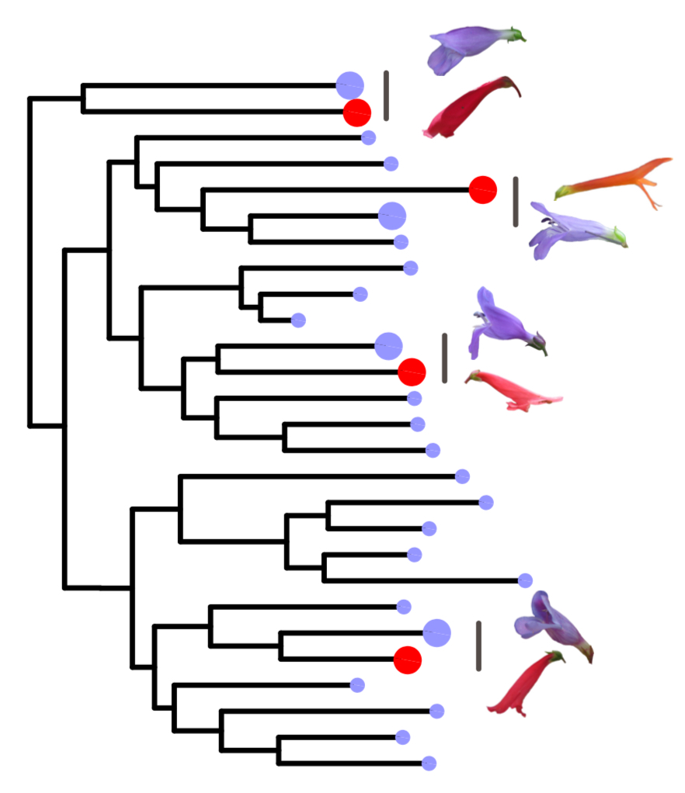

<!--hello, this is an html comment--> 
<!--the title here NORMALLY controls the big text at the top of this web page as well as the title shown within the tab but I changed that so this title only controls the text within the tab for all .Rmds/.htmls (the change is coded within the in_header.html) because I wanted the information in the tab to say something different than the text at the top of each web page--> 
<br>
<!-- anything within carrots is html code that will by knitted into the .html output my knitting the .rmd-->
<!-- br means break and inserts an empty line, i think the size of the break is based on the default size of the body text-->

# Join Us!
<!-- header 1, aka the large font that is centered at the top of the web page, best to leave a line between headers and other code, otherwise sometimes rmd won't format them correctly -->
 

<!--the code below indicates this is a code block containing code (within the ```) in the language css and we don't want this code to be echoed onto the website (echo=F)-->
<!--note: no comments can be made within the code block bc rmd is weird so all comments will be below the block and will occur below a comment out version of the thing exactly as it appears within the block,--> 

```{css, echo=FALSE}
caption {
  display: table-caption;
  text-align: left;
  font-size: 14px;
  padding: 10px;
  color: black;
}

@media screen and (max-width: 480px) {
  table{
    width: 100%;
    position: center;
  }
  img{
    align: center;
  }
}
```
<!-- ```{css, echo=FALSE} -->
 <!-- html { -->
 <!--   background: url(images/wrightii_thin.jpg);  -->
 <!--   background-size: 50%; -->
 <!--   height: 100%; -->
 <!--   background-position: right center; -->
 <!--   background-repeat: no-repeat; -->
 <!-- } -->

<!-- the html object formatted above (still in the language css) sets the background image used for this web page 
#IMP the image is dynamically scaling when set this way meaning it's size and what is show changes when you change your browser/screen size
the url() command tells the computer where this image is currently located compared to the director the rproj is in so it's in a folder called images and the image itself is called wrightii_thin.jpg
background-size: 50%; is what makes this image cover the half of the width of the screen
height: 100%; ensure the image takes up 100% of the screen height
background-position: right center; centers the image vertically and moves it to the right horizontally
background-repeat: no-repeat; means if the screen is too big that the image can't take up the whole thing, don't repeat the image

<!-- body { -->
<!--    color: black; -->
<!--    position: relative;  -->
<!--    left: 0;  -->
<!--    top: 10px; -->
<!--    width: 50%;  -->

<!-- } -->

<!--the body object formatted above (still in the language css) sets the style for the "body" aka the actual text within this web page
#IMP: this body is set here because it is different than the way we generally want the body formatted in the other pages, if it was something that we wanted on all of the pages then we would set it within the style.css
color: sets the color of the text
position: relative; sets the position to be the changed (according to formatting below) as relative to what it would "normally" be... I think
left: 0 the body will start 0 pixels from the left of the screen aka will be left justified
top: 10 px means the body will start 10 pixels down from the top of the screen (again regardless of width or other things contained withing this page as discussed above)
width: 50% sets the width of the body to cover half of the width of the screen-->

<!-- @media screen and (max-width: 480px) { -->
<!--     html { -->
<!--      background: url(images/wrightii_thin.jpg); -->
<!--      background-size: cover; -->
<!--      background-attachment: fixed; -->
<!--      background-position: center; -->
<!--      background-repeat: no-repeat; -->
<!--     } -->
<!--     body { -->
<!--      color: black; -->
<!--      left: 0;  -->
<!--      width: 100%;  -->
<!--      background: rgba(211, 211, 211, .5); -->
<!--   } -->
<!-- } -->
<!-- @media screen and (max-width: 480px): this block changes the settings that were discussed above to be different if the screen size is smaller than 480 pixels in width aka on phones/ipads because the formatting as it was looked super bad on phones before

you can check what this looks like after knitting this web page by narrowing your screen until it shifts into the different formatting

the html{} object is formatted to be different than  the default for bigger screens that was discussed above, because having an image take up half of a small screen is not very readable SO:
<!-- the html object formatted above (still in the language css) sets the background image used for this web page 
#IMP the image is dynamically scaling when set this way meaning it's size and what is show changes when you change your browser/screen size
the url() command tells the computer where this image is currently located compared to the director the rproj is in so it's in a folder called images and the image itself is called australis_new.jpg
background-position: center; just centers the image vertically and horizontally within the screen
background-repeat: no-repeat; means if the screen is too big that the image can't take up the whole thing, don't repeat the image
background-size: cover is what makes this image cover the entire width of the screen
background-attachment: fixed; is kind of complicated but means that is there is enough text that the screen needs to scroll, keep the image fixed in it's place aka don't scroll with the text -->

<!--the body{} object formatted above (still in the language css) sets the style for the "body" aka the actual text within this web page
#IMP: this body is set here because it is different than the way we generally want the body formatted in the other pages, if it was something that we wanted on all of the pages then we would set it within the style.css
color: sets the color of the text
left: 0 means the body will start 0 pixels from the left of the screen (again regardless of width or other things contained withing this page as discussed above)
width: 100% sets the width of the body to cover 100% of the width of the screen
background: rgba(211, 211, 211, .5); sets the background of the body to be a light grey (hex code 211, 211, 211) with an alpha (transparency) value of .5 (50% opaque) -->

<br>

### We are currently growing our lab, thanks to recent funding from the NSF and NIH !

***

### Postdoc Research Opportunity

<table class="image" align="right">
<caption align="bottom">Four convergent origins of hummingbird syndrome in a focal Penstemon clade</caption>
<tr><td></td></tr>
</table>

We welcome applications from prospective postdocs interested in the following types of questions, with space to develop independent research directions:

  * What is the contribution of introgression to patterns of parallel trait evolution and speciation?
  * What is the genetic and genomic architecture for adaptive evolution?
  * How is complex trait variation maintained in recently diverged species?
  * What components of parallel evolution occur through similar genetic changes?

Expertise in population genomics, phylogenomic analyses, quantitative genetics, and fieldwork are a plus! 

Flexible start date and competitive salary. Please email Carrie with a statement of interest and CV.


***

### Graduate Student Opportunity

We are currently recruiting a graduate student interested in studying the genetic and ecological mechanisms for floral variation within and across populations. Interested prospective students should please send Carrie a CV and a description of your research interests (and how working with us would help you meet these interests).

<table class="image" align="center">
<caption align="bottom">Widespread flower color polymorphism in P. whippleanus. </caption>
<tr><td></td></tr>
</table>

***

### Undergraduate Research Opportunities
<!--h4 header, 4rd biggest, size set in style.css, this is consistent for all headers below-->

Undergraduates interested in evolutionary genetics are encouraged to inquire about research opportunities in the lab. Please reach out to Carrie to introduce yourself and your research interests. A great time to begin undergraduate research is in your sophomore year. 

***
<!--actual body of the page, formatted first by the body{} objects set above in the css block and second by the the style.css
body is followed by 2 breaks together, same is true for all sections below just to keep formatting consistent-->


### About the University of South Carolina

UofSC is located in downtown Columbia, South Carolina. The campus has a rich history and a current focus on promoting new research.
<br><br>


You can contact Carrie at:
wessinc[at]mailbox.sc.edu

