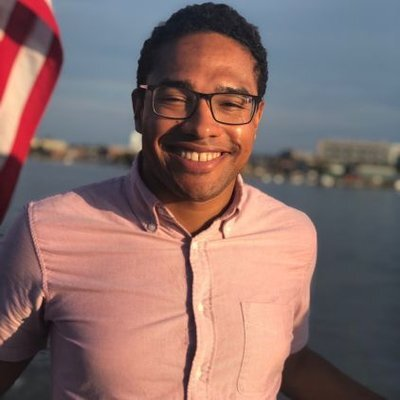

<!--hello, this is an html comment--> 
<!--the title here NORMALLY controls the big text at the top of this web page as well as the title shown within the tab but I changed that so this title only controls the text within the tab for all .Rmds/.htmls (the change is coded within the in_header.html) because I wanted the information in the tab to say something different than the text at the top of each web page--> 
<br>
<!-- anything within carrots is html code that will by knitted into the .html output my knitting the .rmd-->
<!-- br means break and inserts an empty line, i think the size of the break is based on the default size of the body text-->

# Lab Members
<!-- header 1, aka the large font that is centered at the top of the web page, best to leave a line between headers and other code, otherwise sometimes rmd won't format them correctly -->


<!--the code below indicates this is a code block containing code (within the ```) in the language css and we don't want this code to be echoed onto the website (echo=F)-->
<!--note: no comments can be made within the code block bc rmd is weird so all comments will be below the block and will occur below a comment out version of the thing excatly as it appears within the block,--> 
<!-- ```{css, echo=FALSE}
<!-- img { -->
<!--     width:  400px; -->
<!--     height: 400px; -->
<!--     padding: 10px; -->
<!--     object-fit: cover; -->
<!-- } -->
<!-- in this css code block the images called within the rest of this web page (with the html tag "img") are formatted to all be the same size (height:400px; and width:400px; means a square with a height and width of 400 pixels each) with 10 pixels of padding around it (padding: 10px; keeps from the text being too close to it)
object-fit: cover; defines how the actual image fits within the image container that is made by the height, width and padding commands above), this ensures that if the raw image is bigger or smaller than the set height and width, it will be resized to take up all available space while maintaining the right aspect ratio, if you don't like how one of the images looks here DO NOT CHANGE THIS instead crop the image differently -->
<!-- removing the above code from working bc I want to add in twitter images, this formatting will now be in each image itself instead of above-->


<!-- this is html that calls the container "img" (styled above in css) and fills it with the image linked within the src="path/to/img/from/rproj/dir"
align="left" aligns this image to the LEFT of the screen 
height=400px and width=400px means a square with a height and width of 400 pixels each
style = everything that follows after this is css code 
"padding: 10px; gives 10 pixels of padding around it the image 
object-fit: cover;" defines how the actual image fits within the image container that is made by the height, width and padding commands above), this ensures that if the raw image is bigger or smaller than the set height and width, it will be resized to take up all available space while maintaining the right aspect ratio, if you don't like how one of the images looks here DO NOT CHANGE THIS instead crop the image differently-->

<br>
<!-- for each person, I currently have set the image (see above) then one break (this line) then their name as a h4 (see below)-->

#### Carrie Wessinger 
<!-- 4 hastags mean this is a header of size h4, the fourth biggest (size set in style.css), this size is currently consistent for all people's names within this page-->

Carrie started the lab at the University of South Carolina in the Spring of 2020. She is a native of Portland, Oregon and earned her BS in Biology from Brown University where she gained an appreciation for organismal and evolutionary biology. She then worked with Mark Rausher at Duke University for her PhD and worked with Lena Hileman (and John Kelly) at the University of Kansas for her postdoc, all current collaborators. She is fascinated by the phenomenon of parallel evolution. Outside of work, she loves exploring Columbia and the natural beauty of South Carolina. 
<!-- body text about the person (size set in style.css)-->

<a href="pdfs/latest.CV.wessinger.pdf" target="_blank">CV</a>

wessinc[at]mailbox.sc.edu
<br>

<!-- after each person I have inserted two separated breaks (takes up more space than 2 together... not sure why) and then the *** which draws a line -->

***

<!-- this is html that calls the container "img" (styled above in css) and fills it with the image linked within the src="path/to/img/from/rproj/dir"
align="left" aligns this image to the RIGHT of the screen, this is different than the image above and makes the alternating pattern currently seen on the website -->

<br>
<!-- for each person, I currently have set the image (see above) then one break (this line) then their name as a h4 (see below)-->

#### Ben Stone 
<!-- 4 hastags mean this is a header of size h4, the fourth biggest (size set in style.css), this size is currently consistent for all people's names within this page-->

Ben is an NSF Postdoc Fellow in the lab. He received his BS in Evolution, Ecology, and Organismal Biology at The Ohio State University. He stayed at OSU to work with Andi Wolfe for his PhD, where he studied comparative phylogeography and systematics in Penstemon subgenus Dasanthera. Ben's research focuses on hybridization and transitions to hummingbird pollination in the Dasanthera clade of Penstemon. Outside of the lab, Ben likes exploring nature and playing music. Ben joined the lab in the Fall of 2021. Ben will be starting as an Assistant Professor in Fall 2025 at Mississippi State University!

[Stone Lab at MSU!](https://benstemon.github.io)

<!-- body text about the person (size set in style.css)-->

<br><br><br><br>

***

<!-- this is html that calls the container "img" (styled above in css) and fills it with the image linked within the src="path/to/img/from/rproj/dir"
align="left" aligns this image to the RIGHT of the screen, this is different than the image above and makes the alternating pattern currently seen on the website -->

<br>
<!-- for each person, I currently have set the image (see above) then one break (this line) then their name as a h4 (see below)-->

#### Aidan Short
<!-- 4 hastags mean this is a header of size h4, the fourth biggest (size set in style.css), this size is currently consistent for all people's names within this page-->

Aidan is an NSF Postdoc Fellow in the lab studying how divergent pollinator adaptation contributes to genome divergence and speciation.  To do this he is analyzing patterns of selection and gene flow between the sister species Penstemon barbatus and virgatus, and is also performing simulations of pollinator isolation. Aidan developed an interest in speciation as a PhD student in Matt Streisfeld's lab where he studied the outcomes of hybridization within the Mimulus aurantiacus species complex. Outside of the lab, he enjoys spending time with his wife and son. He joined the lab in January 2025.


<br><br><br><br>

***

<!-- this is html that calls the container "img" (styled above in css) and fills it with the image linked within the src="path/to/img/from/rproj/dir"
align="left" aligns this image to the RIGHT of the screen, this is different than the image above and makes the alternating pattern currently seen on the website -->

<br>
<!-- for each person, I currently have set the image (see above) then one break (this line) then their name as a h4 (see below)-->

#### Josh Stevens 
<!-- 4 hastags mean this is a header of size h4, the fourth biggest (size set in style.css), this size is currently consistent for all people's names within this page-->

Josh is a PhD student in the lab. He obtained his undergraduate degree at Keene State College. Josh's research focuses on gene flow and mating patterns within various species of Penstemon. He is broadly interested in evolutionary ecology & bioinformatics. He enjoys hiking, kayaking, and exploring new areas. Josh joined the Wessinger lab in the Fall of 2020. 


<!-- body text about the person (size set in style.css)-->
<br><br><br><br>

***


<br>

#### Trinity Depatie 

Trinity joined the lab as a PhD student in the fall of 2020, and is interested in the evolution of floral morphological traits. Her dissertation focuses on the ecological function and genetic basis of personate flowers in Penstemon's eastern clade (sect. Penstemon). Outside of lab, Trinity likes baking, hiking, and riding horses. 

[Trinity's website](https://www.trinityhdepatie.com)

<br>

<br>

<br>

<br>

*** 

  
<br>

#### Zack Radford

Zack is a PhD student in the lab. He obtained a BS in Ecology, Evolution, and Behavior at the University of Minnesota. He then worked as a lab technician for Dave Moeller and Ya Yang working on several different projects related to dispersal, adaptation, complex traits, and metabolite evolution. Zack’s research involves investigating the basis for complex trait evolution in Penstemon, particularly flower color polymorphism in Penstemon whippleanus. In his free time he enjoys backpacking, music, and long walks on scree.

<br>

<br>

<br>

<br>

*** 

  
<br>

#### Palmer Lambert

Palmer joined the lab as a technician in fall of 2024. He received a BS in environmental ecology at the University of Dayton. Since graduating, he has worked as a field technician for the USFS, collecting fire ecology data for Morris Johnson of the University of Washington. Palmer has a broad interest in environmental ecology and joined the lab to learn more about evolutionary ecology. His current roles within the lab are developing morphometric approaches to analyze flower shape data, helping to run the lab, and supporting his labmates’ research. Away from lab, he enjoys hiking, hunting, fishing, and crocheting.

<br>

<br>

<br>

*** 

# Lab Alumni 

#### [Click here to meet our former lab members!](./alumni_people.html)


