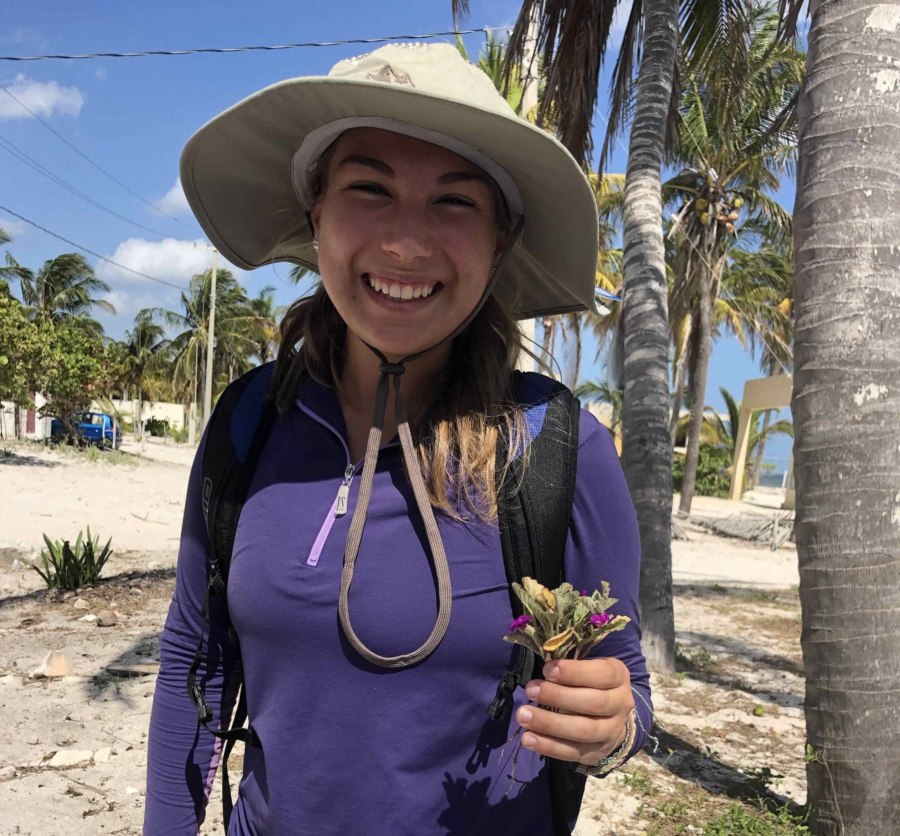

<br>

# Lab Members

```{css, echo=FALSE}
img {
    width:  400px;
    height: 400px;
    padding: 10px;
    object-fit: cover;
}
```


<br>

#### Carolyn Wessinger 
###### aka **Carrie**


Carrie started her lab at the University of South Carolina in the Spring of 2020. She is interested in examining microevolutionary processes that drive trait evolution and larger evolutionary patterns. Currently, she is working to study floral adaptation in the plant genus Penstemon using a genetic approach. Many projects are in collaboration with the [Hileman Lab](http://www.hilemanlab.org/) and the [Kelly Lab](http://eeb.ku.edu/sites/eeb.ku.edu/files/files/jkk/index.html) at the University of Kansas. She began this research during my PhD in the [Rausher Lab](http://people.duke.edu/~mrausher/) at Duke University.  

<br>

<br>

***


<br>

#### Josh Stevens

Josh obtained his undergraduate degree at Keene State College and is now a PhD student at the University of South Carolina. Josh's research focuses on gene flow and mating patterns within various species of Penstemon. He is broadly interested in evolutionary ecology & bioinformatics. He enjoys hiking, kayaking, and exploring new areas. Josh joined the Wessinger lab in the fall of 2020. 

Josh says this picture of his puppy is a good representation of who he is as a person.

<br>

<br>

***



<br>

#### Trinity Depatie

Trinity is a PhD student at the University of South Carolina focusing on the evolution of morphological floral traits in the Eastern Clade of the genus Penstemon. Trinity has broad interests in floral evolution, ecology, and genetics. She obtained her undergraduate degree at Florida Atlantic University’s Wilkes Honors College and later joined the Wessinger lab in the fall of 2020. Outside of the lab Trinity enjoys running and riding horses. 


<br>

<br>

<br>

*** 


<br>

#### Ashley Hamilton


Ashley is a lab technician who graduated with a BS in Biology from Texas A&M University- Corpus Christi in Fall 2019. She was originally planning on pursuing marine biology but fell in love with plants and plant evolution during a class on research methodology in the rainforests of Costa Rica. Since then, she has pursued these avenues of research passionately, conducting research on a variety of organsims from limpets to seagrass. Currently, she working on several projects in the Wessinger Lab including analyzing morphological traits and geographic varaibles to try to understand underlying evolutionary processes at both the population and species level within *Penstemon*.

<br>

<br>

*** 

  
<br>

#### Nimue' Shive 

Nimue’ Shive is an undergraduate lab assistant in the Wessinger Lab. She is a sophomore enrolled in The University of South Carolina Honors College and is majoring in Environmental Science. In the Wessinger Lab, she assists with plant care and is helping map *Penstemon* species ranges. She enjoys hiking, art, and chocolate cake.
