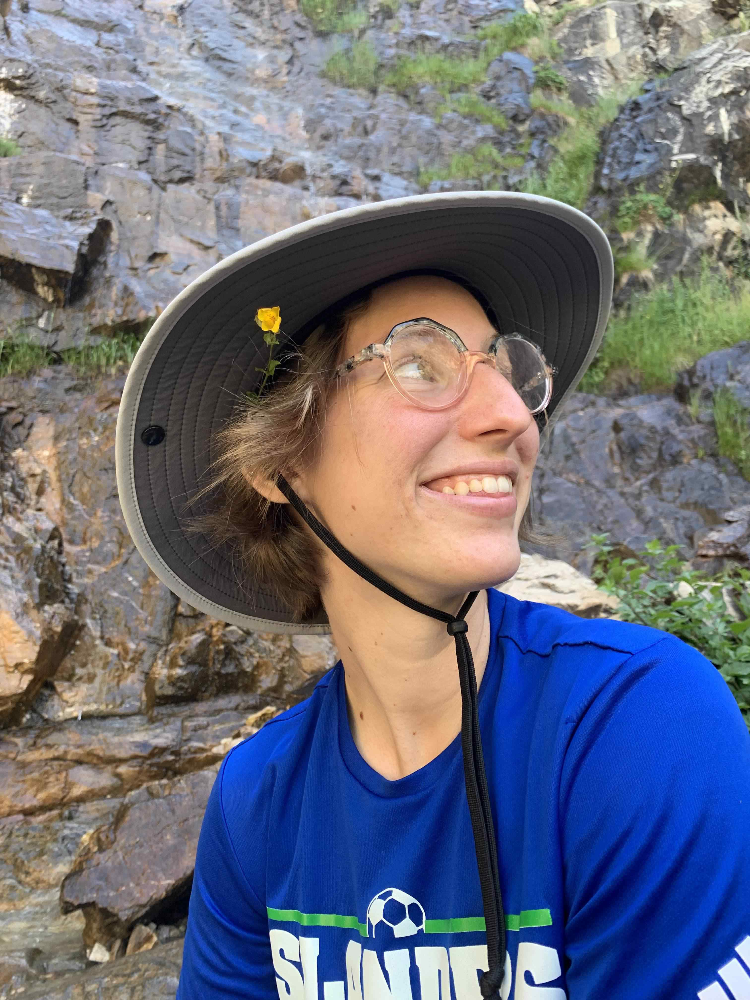

```{css, echo=FALSE}
h1 {
  text-align: center;
}
```

#### Carolyn Wessinger 
###### aka **Carrie**


Carrie started her lab at the University of South Carolina in the Spring of 2020. She is interested in examining microevolutionary processes that drive trait evolution and larger evolutionary patterns. Currently, she is working to study floral adaptation in the plant genus Penstemon using a genetic approach. Many projects are in collaboration with the [Hileman Lab](http://www.hilemanlab.org/) and the [Kelly Lab](http://eeb.ku.edu/sites/eeb.ku.edu/files/files/jkk/index.html) at the University of Kansas. She began this research during my PhD in the [Rausher Lab](http://people.duke.edu/~mrausher/) at Duke University.  

***
```{r, echo=FALSE, out.width="40%", out.extra='style="float:right; padding:10px"'}
knitr::include_graphics("images/Josh_puppy.jpg") #if image is in wrong orientation, use image editor to flip it and save as tif in the correct folder
```
<br>

#### Josh Stevens

Josh obtained his undergraduate degree at Keene State College and is now a PhD student at the University of South Carolina. Josh's research focuses on gene flow and mating patterns within various species of Penstemon. He is broadly interested in evolutionary ecology & bioinformatics. He enjoys hiking, kayaking, and exploring new areas. Josh joined the Wessinger lab in the fall of 2020. 

Josh says this picture of his puppy is a good representation of who he is as a person.

<br><br><br>

<br><br>


***
```{r, echo=FALSE, out.width="40%", out.extra='style="float:left; padding:10px"'}
knitr::include_graphics("images/Trinity.jpg") #if image is in wrong orientation, use image editor to flip it and save as tif in the correct folder
```
<br>

#### Trinity Depatie

Trinity is a PhD student at the University of South Carolina focusing on the evolution of morphological floral traits in the Eastern Clade of the genus Penstemon. Trinity has broad interests in floral evolution, ecology, and genetics. She obtained her undergraduate degree at Florida Atlantic University’s Wilkes Honors College and later joined the Wessinger lab in the fall of 2020. Outside of the lab Trinity enjoys running and riding horses. 

<br><br><br>

<br><br><br>

<br><br>

*** 

```{r, echo=FALSE, out.width="35%", out.extra='style="float:right; padding:10px"'}
 #if image is in wrong orientation, use image editor to flip it and save as tif in the correct folder
```

<br>

#### Ashley Hamilton


Ashley is a lab technician who graduated with a BS in Biology from Texas A&M University- Corpus Christi in Fall 2019. She was originally planning on pursuing marine biology but fell in love with plants and plant evolution during a class on research methodology in the rainforests of Costa Rica. Since then, she has pursued these avenues of research passionately, conducting research on seagrass genetic diversity under Dr. Patrick Larkin and limpet biogeography under Dr. Chris Bird as well as participating in an REU looking at landscape genetics of prairie plants under Dr. Mitch Cruzan at Portland State University and another REU under Dr. Stacey Smith at the University of Colorado at Boulder investigating potential carotenoid genes associated with flower color variation in Petunieae. Currently, she working on two projects in the Wessinger Lab: 1) understanding the effect of variable herkogamy on outcrossing rates within a population of *Penstemon cobaea* and 2) analyzing range size and niche breadth differences in *Penstemon* species with different pollination syndromes. She enjoys spending her spare time rock climbing, reading, wildflower hunting, and hiking.

<br><br>

*** 

```{r, echo=FALSE, out.width="35%", out.extra='style="float:right; padding:10px"'}
knitr::include_graphics("images/Nimue'.jpg") #if image is in wrong orientation, use image editor to flip it and save as tif in the correct folder
```

<br><br><br>

<br>

#### Nimue' Shive 

Nimue’ Shive is an undergraduate lab assistant in the Wessinger Lab. She is a sophomore enrolled in The University of South Carolina Honors College and is majoring in Environmental Science. In the Wessinger Lab, she assists with plant care and is helping map *Penstemon* species ranges. She enjoys hiking, art, and chocolate cake.
