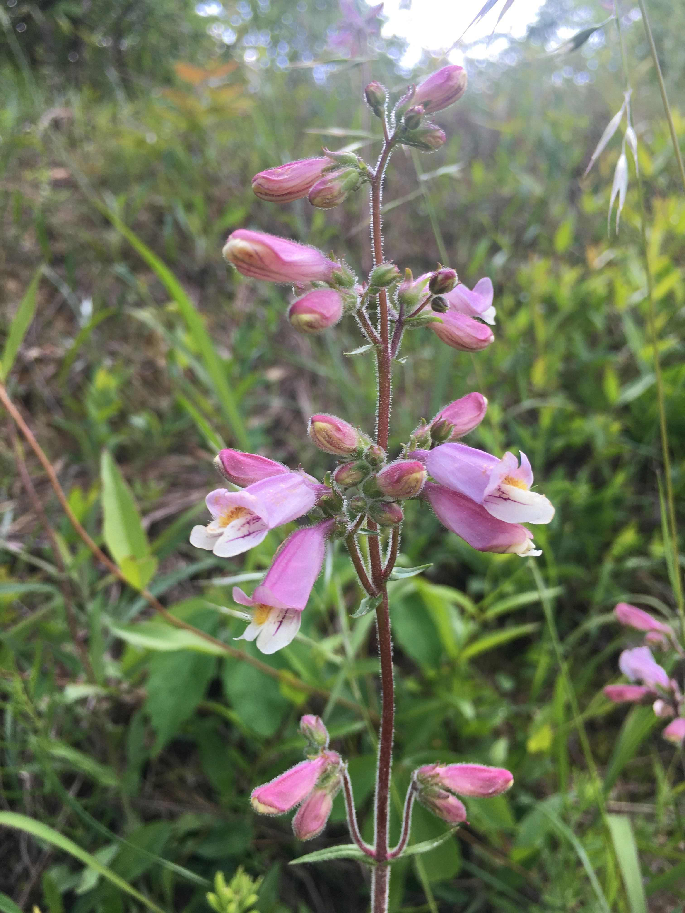

```{css, echo=FALSE}
h1 {
  text-align: center;
}
```

[Katzer, A. M., Wessinger, C. A., & Hileman, L. C. (2019). Nectary size is a pollination syndrome trait in Penstemon. New Phytologist, 223(1), 377-384.](https://doi.org/10.1111/nph.15769)


[Wessinger, C. A., Rausher, M. D., & Hileman, L. C. (2019). Adaptation to hummingbird pollination is associated with reduced diversification in Penstemon. Evolution letters, 3(5), 521-533.](https://doi.org/10.1002/evl3.130)

<br><br><br>

```{r, echo=FALSE, out.width="50%", fig.align = 'center'}

```