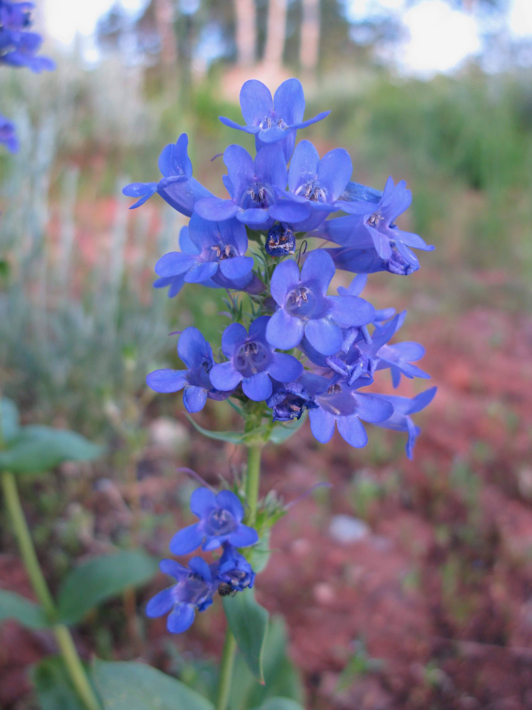
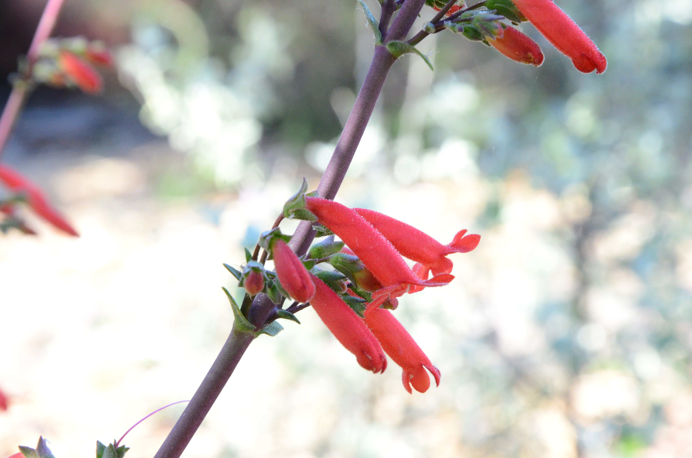

```{css, echo=FALSE}
h1 {
  text-align: center;
}
```


Our research investigates how genetic and ecological processes at the population level contribute to larger patterns and trends in complex trait evolution, specifically parallel evolution. Currently we are exploring these issues in *Penstemon*, an emerging model system for floral evolution.

```{r, echo=FALSE, out.width="25%",fig.cap="Top: *P. neomexicanus*, bee syndrome. Bottom: *P. barbatus*, hummingbird syndrome", out.extra='style="float:right; padding:10px; text-align: right"'}
knitr::include_graphics("images/neomex.barbatus.jpg") 
```

*Penstemon* is a large North American plant genus that is ancestrally adapted to bee pollination. Flowers adapted to hummingbird pollination have repeatedly evolved (an estimated 15-20 times!) through complex change to multiple floral traits, with little evidence of evolutionary reversals back to bee syndrome. Recent macroevolutionary analyses suggest hummingbird syndrome is associated with reduced diversification rate within *Penstemon*.

This impressive parallel evolution in a complex trait makes *Penstemon* a fantastic comparative system to study a variety of questions above and below the species level. We study these questions using a variety of approaches: population genomics, QTL mapping, quantitative genetics, comparative studies, phylogenetics, and modeling approaches.


***

##**What is the source of genetic variation for repeated evolution in a complex trait?**

```{r, echo=FALSE, out.width="20%", fig.cap="Ancestral character reconstruction. Blue: bee syndrome, Red: hummingbird syndrome.", out.extra='style="float:left; padding:10px"'}
knitr::include_graphics("images/crownML.B1.asr.pdf")
```

Our best estimate of the species tree suggests hummingbird syndrome has evolved many independent times. Perhaps this makes this trait highly genetically "accessible" in *Penstemon*. 

What are the relative roles of *de novo* mutations, introgression, and/or ancestral polymorphism in the repeated evolution of hummingbird syndrome traits?

Data from an initial cross suggest relatively few QTLs of major effect underlie the evolution of hummingbird syndrome in this case. Are the genetic architectures and/or QTL positions similar across independent origins of hummingbird adaptation?


***

##**What microevolutionary processes contribute to differential diversification rates?**

Does pollination by bees vs. hummingbirds structure genetic variation in different ways within and between populations across the landscape? 

If so, could this affect species diversification rates, providing a link between microevolutionary processes and a macroevolutionary pattern?


***

##**Interactions between speciation and complex adaptation**

Closely-related Penstemon species with alternative pollination syndromes often have at least partially overlapping distributions. How are species boundaries (and divergent floral adaptations) are maintained in the face of gene flow?

***

##**How do complex traits vary within populations**

```{r, echo=FALSE, out.width="50%", out.extra='style="float:right; padding:10px"'}
knitr::include_graphics("images/hirsutus.smallii.jpg")
```

Recent work in a bee-pollinated population found that flower shape traits are positively correlated, parallel to the direction of selection during adaptation to hummingbird pollination. *This is proof-of-concept that this approach can detect small effect loci associated with trait variation in natural populations.*

What is the heritability of complex floral variation within populations and what is their effects on mating system?

***
##**Effects of trait evolution on mating system and vice versa**

Recent modeling work suggests that reproductive features of populations can influence pollinator transitions. Specifically, the capacity for delayed selfing broadens the conditions where transitioning to a new pollinator such as hummingbirds is favored. This predicts transitions to hummingbird pollination may occur more frequently in self-compatible lineages. 
 
On the flip side, does pollination by hummingbirds vs. bees impact mating system in terms of mate diversity and frequency of self-fertilization? This would affect the structure of genetic diversity within populations and may be relevant for macroevolutionary dynamics. 

***

##**Additional research directions**

```{r, echo=FALSE, out.width="20%", out.extra='style="float:left; padding:10px"'}

```
```{r, echo=FALSE, out.width="35%", out.extra='style="float:right; padding:10px"'}

```

###What is the degree of morphological convergence in parallel adaptation?

How convergent are hummingbird syndrome species in multivariate trait space? Do we see a single cloud of points or multiple peaks? Is shape related to the shape of ancestral bee syndrome species (suggesting adaptation along lines of least resistence?) Or can same hummingbird syndrome form be accessed from anywhere in bee syndrome morphospace? Does shape similarity correlate with history of introgression?