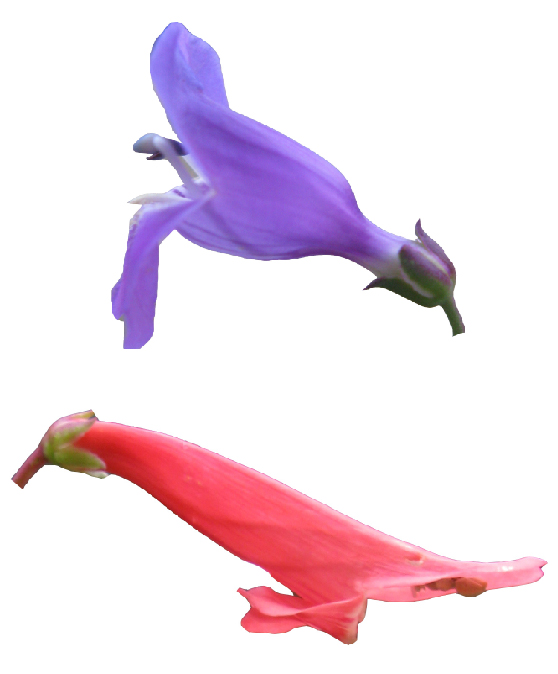

<!--hello, this is an html comment--> 
<!--the title here NORMALLY controls the big text at the top of this web page as well as the title shown within the tab but I changed that so this title only controls the text within the tab for all .Rmds/.htmls (the change is coded within the in_header.html) because I wanted the information in the tab to say something different than the text at the top of each web page--> 
<br>
<!-- anything within carrots is html code that will by knitted into the .html output my knitting the .rmd-->
<!-- br means break and inserts an empty line, i think the size of the break is based on the default size of the body text-->


<!--the code below indicates this is a code block containing code (within the ```) in the language css and we don't want this code to be echoed onto the website (echo=F)-->
<!--note: no comments can be made within the code block bc rmd is weird so all comments will be below the block and will occur below a comment out version of the thing exactly as it appears within the block,--> 
```{css, echo=FALSE}
caption {
  display: table-caption;
  text-align: left;
  font-size: 14px;
  padding: 10px;
  color: black;
}

@media screen and (max-width: 480px) {
  table{
    width: 100%;
    position: center;
  }
  img{
    align: center;
  }
}
```
<!-- caption { -->
<!--   display: table-caption; -->
<!--   text-align: left; -->
<!--   font-size: 14px; -->
<!--   padding: 10px; -->
<!-- } -->

<!-- the caption object formatted above (still in the language css) sets the style for the "captions" aka the image+caption pairs within this webpage
display: table-caption; sets the display of any object called with the tag "caption" to be a table and a caption (the table is where we will insert the image)
text-align: left; left aligns the text within any caption
font-size: 14px; sets the font of the text within the image captions
left: 0 means the body will start 0 pixels from the left of the screen (again regardless of width or other things contained withing this page as discussed above)
padding: 10px; sets the padding to be 10px around the entire caption object (the text AND the image) -->


<!-- @media screen and (max-width: 480px) { -->
<!--   table{ -->
<!--     width: 100%; -->
<!--     position: center; -->
<!--   } -->
<!-- } -->

<!-- the table object formatted above (still in the language css) sets the style for the "table" aka the image+caption pairs within this web page when the web page is smaller than 480 pixels (aka a phone or ipad screen)
width: 100%; sets the entire object (image+caption) to take up 100% of the screen, ensures that the texts isn't weirdly wrapping these images
position: center; centers the entire object (image+caption) on the screen, BUT doesn't center the image contained within the table itself.... a problem that I am currently working on -->


# Current Research
<!-- header 1, aka the large font that is centered at the top of the web page, best to leave a line between headers and other code, otherwise sometimes rmd won't format them correctly -->

<br>

#### ***How do complex adaptations rapidly - and repeatedly - evolve during species radiations?***

We seek to understand how genetic and ecological processes generate and maintain trait diversity. We are primarily exploring these issues in *Penstemon*, an enigmatic comparative system for studying complex trait evolution. Our work developing *Penstemon* as a model for evolutionary genetics is collaborative with [Lena Hileman](http://www.hilemanlab.org/), [John Kelly](https://eeb.ku.edu/john-kelly), [Mark Rausher](http://people.duke.edu/~mrausher/), and [Kate Ostevik](https://www.osteviklab.com/).

<br>

***

### **Exceptional convergent evolution in *Penstemon* **

<!-- body text about the general research of the lab (size set in style.css), the * * around a word make the word italicized-->

<table class="image" align="right">
<caption align="bottom">Top: Bee-adapted species. Bottom: hummingbird-adapted species.</caption>
<tr><td></td></tr>
</table>

<!-- <table class="image" align="right"> -->
<!-- inserts a table of class image and aligns that table to the right (formatting corresponds to the table tag set in css above, although currently only set for when the screen size is small)-->

<!-- <caption align="bottom">Top picture: *P. neomexicanus*, bee syndrome. Bottom pucture: *P. barbatus*, hummingbird syndrome.</caption> -->
<!-- inserts a caption that is attached to the table inserted above (as styled by the caption tag set in css above) and aligns that caption to the bottom of the table (aka image) (the ** around a word still make the word italicized)
the </caption> tells html that is where the caption ends -->

<!-- <tr><td></td></tr> -->
<!-- the tr tag means this line represents a row in the table and the td tag means this is a "daughter cell" of the table, basically these tags just say in html that this image is meant to be inserted into the table
the 
<!--  this tells the html that this is where the table object, (opened at the start with "<table" ends) -->

In the North American wildflower genus *Penstemon*, evolutionary transitions from bee to hummingbird pollination have occurred in an estimated 20+ lineages through changes to a complex of floral traits. Recent macroevolutionary analyses suggest that transitions to hummingbird pollination are associated with reduced speciation rates and that reversals back to bee pollination are rare.

We view *Penstemon* as an exceptional comparative system to study fundamental evolutionary genetics questions, using approaches such as population genomics, quantitative genetics, comparative studies, phylogenomics, and modeling. 

<br><br><br>

<!-- for each topic, I currently have set the image+caption (see above) then three breaks (this line) then a line (below) and then the next topic-->

***

### **What is the source of genetic variation for widespread convergent evolution?**
<!--h3 header, 3rd biggest, size set in style.css, this is bolded as indicated by the ** ** around the words -->

<table class="image" align="left">
<caption align="bottom">Ancestral character reconstruction. Blue: bee syndrome Red: hummingbird syndrome.</caption>
<tr><td></td></tr>
</table>

<!-- image +caption being set as discussed above -->

Hummingbird-adapted flowers have evolved a surprising number of times in separate bee-adapted lineages! This suggest the "hummingbird syndrome" strategy is often favored by selection and is genetically accessible to populations. Does standing variation or gene flow act as a source of adaptive alleles? In theory, adaptive introgression could bypass the waiting times for relevant *de novo* mutations. We are using whole genome resequencing and phylogenomic approaches to address whether hummingbird-adapted species share a history of introgression in genome regions that specify floral traits.

<br><br><br><br>

***

### **What is the genetic architecture of complex traits?**

A critical goal of evolutionary genetics is to characterize the types of mutations that contribute to adaptive trait variation. We are using QTL mapping to examine the genetic basis of repeated shifts to hummingbird pollination using replicate mapping populations. What components of parallel phenotypic evolution occur through similar genetic changes?

In addition, we are studying the ecological function and genetic basis of ***personate flowers*** within *Penstemon*, using field studies and QTL mapping. Personate flowers are dorso-ventrally flattened, impeding pollinator visitation relative to open tubular flowers. Personate flowers have arisen at least twice within *Penstemon*, suggesting they have adaptive significance. However, little is known about how and why this interesting flower shape has evolved!

<table class="image" align="center">
<caption align="bottom">Personate flowers (left) and open tubular flowers (right). </caption>
<tr><td></td></tr>
</table>
 
***

### **How do complex adaptations arise within populations? How are they maintained in the face of gene flow?**

Evolutionary change in complex traits begins with local adaptation within populations. A major challenge is understanding how complex trait differences are maintained in recently diverged taxa that experience gene flow. We are using population genomic approaches to examine the heritability of complex adaptations within populations and to determine the consequences of gene flow on species differentiation. We are focused on recently diverged pairs of sister species that differ in floral syndrome and show evidence of gene flow where species ranges overlap.

<table class="image" align="center">
<tr><td></td></tr>
</table>

***

### **The effects of mating system on adaptation**

<table class="image" align="left">
<tr><td></td></tr>
</table>

Mating system has fundamental effects on the genetics of populations, including the fate of new beneficial alleles. Adaptation to a new pollinator may alter patterns of pollen dispersal within and among populations, with effects on population isolation, local adaptation, and the occurrence of hybridization. We are studying the consequences of pollination system on mating events and population structure, which may have relevance for macroevolutionary dynamics.

***

### Maintenance of variation within populations

We are also using Penstemon species to study the genetic and ecological mechanisms for floral variation within (and across) populations. 

<table class="image" align="center">
<caption align="bottom">Widespread flower color polymorphism in P. whippleanus. </caption>
<tr><td></td></tr>
</table>

